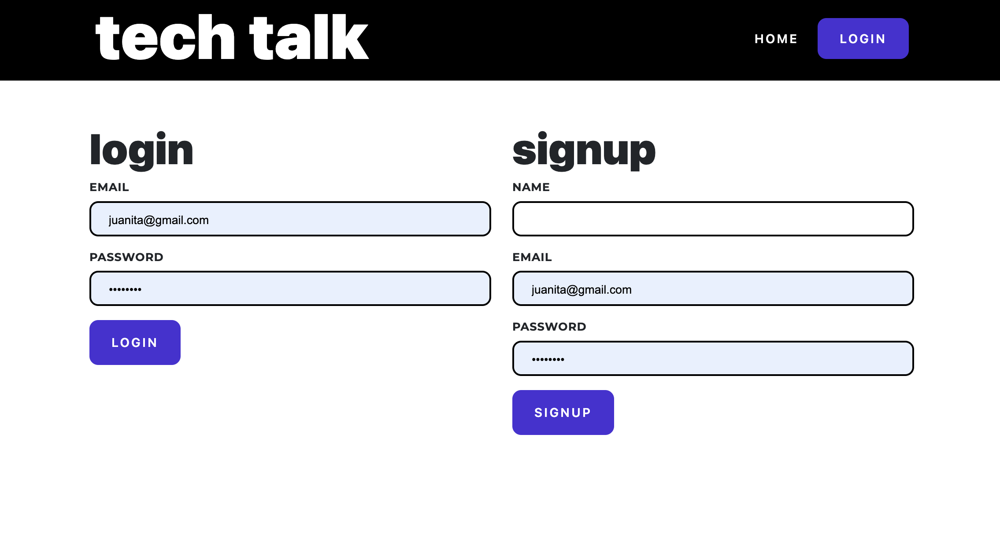
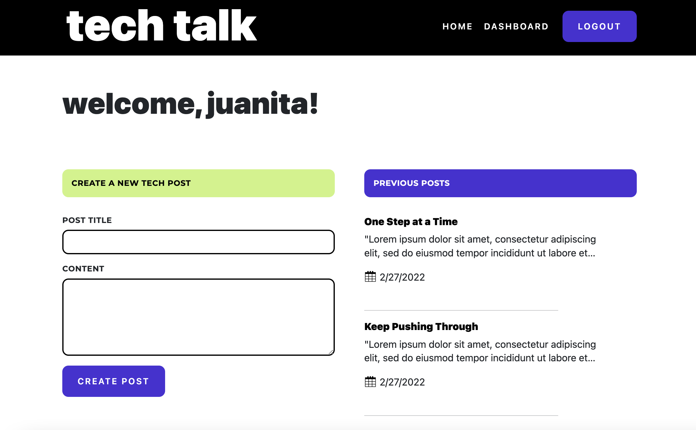
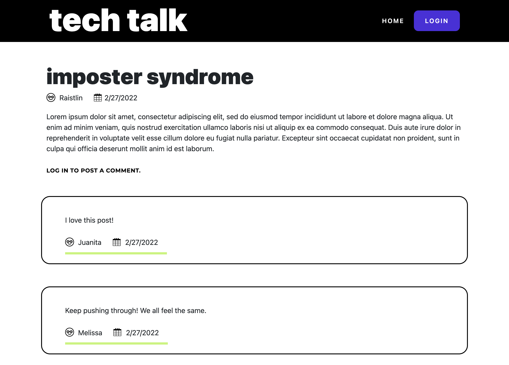
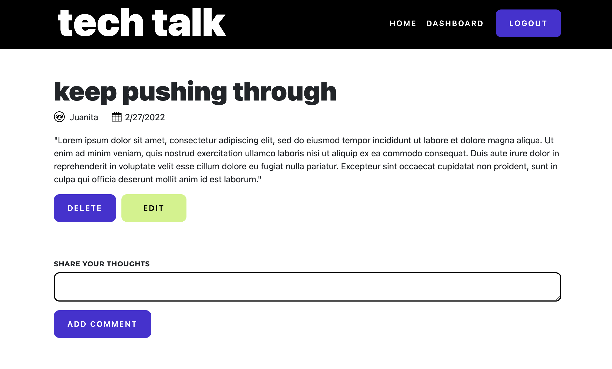
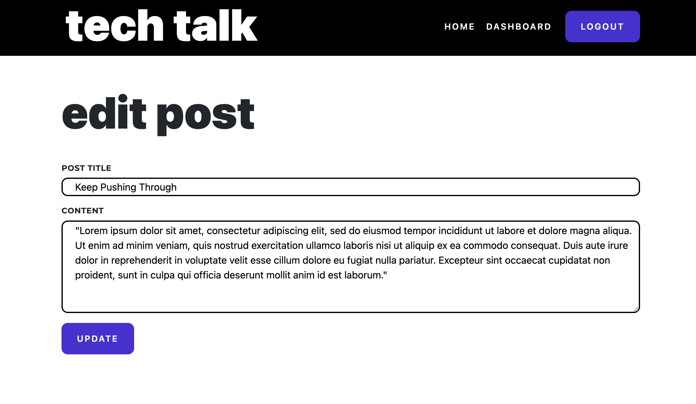

  [](https://opensource.org/licenses/MIT)
  
# Tech Talk

A CMS-style blog site that allows users to publish articles, view blog posts, and post comments to share thoughts and opinions.  

## Description
This application is a CMS-style blog site. When a user visits the site, they are able to view all posts and comments. Each post provides the user with the name of the person that created the post and the date the post was created.

A new site visitor may create an account, which will give them access to submit comments on existing posts and create their own posts. 

A user can come back at any time, log in, and access their dashboard to view all of the posts they have previously submitted. A user that has created posts may edit and/or delete previous posts, giving them complete control over their articles.

The UI is clean, polished, and will help the User navigate the site with ease.

This application was built using the following:

* Javascript
* HTML & cSS
* MySQL
* Sequalize
* Express
* Handlebars
* Bcrypt

The folder structure follows the Model-View-Controller (MVC) paradigm.

## Table of Contents

  * [Description](#description)
  * [Installation](#installation)
  * [License](#license)
  * [Road Bumps](#road-bumps)
  * [Preview](#preview)
  * [Questions](#questions)

## Installation

Clone the repository onto your local environment. 

The following dependancies, listed in `package.json` must be installed to run this application: 

* bcrypt
* connect-session-sequalize
* dotenv
* express
* express-handlebars
* express-session
* mysql2
* sequalize


Run the following code to install the dependancies: 

`npm install` 


## License

This application is covered under the MIT license.


### Application Screenshots

Preview screens of the application. 

#### HOMEPAGE


#### LOGIN


#### DASHBOARD


#### POSTS (LOGGED OUT)


#### POSTS (LOGGED IN)


#### EDIT POST



## Road Bumps

Displaying the comments on the posts was, perhaps, the most significant road bump in creating this application. Configuring the routes correctly was pivotal. When getting the post data, the homeRoutes had to be configured to pull in the Comment model.  

```
router.get('/post/:id', async (req, res) => {
  try {
    const postData = await Post.findByPk(req.params.id, {

      include: [
        User,
        {
          model: Comment,
          attributes: ['id', 'post_comment', 'post_id', 'date_created', 'user_id'],
          include: [User],
        }
      ],
    });
```

Users are able to delete their own posts. In the single post view, the Delete and Edit buttons are visible exlusively to the post creator. This line of code, included in the homeRoutes, when getting a post by id, works that magic: 

`const userPost = postData.user_id === req.session.user_id`.  

## Preview

GitHub Repo: https://github.com/jsamborski310/Tech-Talk

Heroku: https://js-tech-talk.herokuapp.com/


## Questions

For questions about this application or if you would like to collaborate, connect with me on <a href="https://www.linkedin.com/in/juanita-samborski/" target="_blank">Linkedin</a>.

